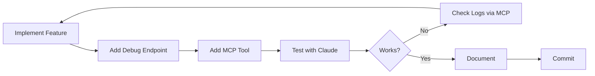

# MCP-Driven Development Workflow

This workflow leverages the Flareup MCP server to enable AI-assisted feature development, testing, and validation. The meta approach: **use the MCP server to help build Flareup itself**.

## 🎯 Core Concept

Every new feature should:
1. **Expose state** via the debug API
2. **Add MCP tools** for AI interaction
3. **Use MCP for testing** during development
4. **Document via MCP** for validation

## 📋 Feature Development Flow

### Step 1: Plan with MCP Awareness

Before implementing, ask:
- [ ] What state needs to be observable?
- [ ] What actions should AI assistants be able to perform?
- [ ] What debug endpoints would help validate this?

**Tools to use:**
```bash
# Check current state
./test-mcp-server.sh

# Review existing MCP tools
cat packages/mcp-server/src/index.ts | grep "name:"
```

### Step 2: Implement the Feature

**Backend (Rust):**
1. Implement the feature in `src-tauri/src/`
2. Add debug API endpoint in `src-tauri/src/debug_api.rs`
3. Add appropriate error handling and logging

**Frontend (Svelte):**
1. Implement UI components
2. Connect to Tauri commands
3. Ensure state is accessible

### Step 3: Expose via Debug API

Add an endpoint to `debug_api.rs`:

```rust
// Example: New feature endpoint
#[tauri::command]
pub async fn debug_get_my_feature(
    state: State<'_, AppState>,
) -> Result<ApiResponse<MyFeatureData>, String> {
    let data = get_my_feature_data(&state).await?;
    Ok(ApiResponse::success(data))
}

// Register in debug_router()
router.get("/my-feature", |req, state| {
    debug_get_my_feature(state).await
})
```

### Step 4: Add MCP Tool

Update `packages/mcp-server/src/index.ts`:

**1. Add tool definition:**
```typescript
{
    name: 'flareup_get_my_feature',
    description: 'Get data from my new feature',
    inputSchema: {
        type: 'object',
        properties: {
            // Add any parameters
        },
        required: [],
    },
}
```

**2. Add client method** in `packages/mcp-server/src/client.ts`:
```typescript
async getMyFeature(): Promise<ApiResponse<MyFeatureData>> {
    return this.fetch<MyFeatureData>('/my-feature');
}
```

**3. Add tool handler:**
```typescript
case 'flareup_get_my_feature': {
    const result = await flareupClient.getMyFeature();
    if (result.success && result.data) {
        return JSON.stringify(result.data, null, 2);
    }
    return `Error: ${result.error}`;
}
```

### Step 5: Test with MCP

// turbo
```bash
# Run health check to verify new endpoint
./test-mcp-server.sh
```

**Use Claude to test your feature:**
1. Ask Claude to call `flareup_get_my_feature`
2. Verify the data structure
3. Test edge cases
4. Check error handling

### Step 6: Add to Test Script

Update `test-mcp-server.sh`:
```bash
echo "Testing My Feature"
echo "-----------------"
test_endpoint "My Feature" "/my-feature" "New feature data"
```

### Step 7: Document and Validate

Create feature documentation that includes:
- MCP tool name and usage
- Example requests/responses
- Integration points
- Testing approach

## 🔄 Iterative Development Loop



## 🛠️ Meta Development Commands

### Query Flareup State During Development

```typescript
// Ask Claude:
"Use flareup_get_logs to show me recent errors"
"Use flareup_get_settings to check current config"
"Use flareup_list_plugins to see what's loaded"
```

### Validate Feature Integration

```typescript
// After implementing a new plugin feature:
"Use flareup_list_plugins and verify XYZ appears"
"Use flareup_get_logs to check for any warnings"
```

### Debug Live Issues

```typescript
"Set log level to debug and show me logs related to 'my_feature'"
"Check frecency data to see if users are engaging with new feature"
```

## 📊 Pre-Commit Checklist

Before committing a new feature:

- [ ] Debug API endpoint returns correct data structure
- [ ] MCP tool is defined with clear description
- [ ] Client method handles errors properly
- [ ] Tool handler formats response appropriately
- [ ] Test script includes the new endpoint
- [ ] Health check passes: `./test-mcp-server.sh`
- [ ] Feature accessible via Claude/MCP client

## 🚀 Advanced Meta Patterns

### 1. AI-Assisted Code Review

```bash
# After implementing a feature, ask Claude:
"Use flareup_get_logs with level=warn to check for issues"
"Compare flareup_get_settings before and after my changes"
```

### 2. Integration Testing

```typescript
// Test complete user flows via MCP:
1. flareup_list_apps (verify app discovery)
2. flareup_get_frecency (check tracking works)
3. flareup_get_logs (verify no errors)
```

### 3. Performance Monitoring

```typescript
// Track performance metrics:
"Check flareup_health uptime and compare response times"
"Use flareup_get_logs to find slow operations"
```

### 4. Feature Usage Analytics

```typescript
// Understand how features are used:
"Use flareup_get_frecency to see most-used commands"
"Check flareup_get_aliases for user customization patterns"
```

## 🎯 Example: Adding a New Feature

**Scenario: Add a clipboard history manager**

1. **Implement** clipboard monitoring in Rust
2. **Expose** `/clipboard-history` debug endpoint
3. **Add MCP tool** `flareup_get_clipboard_history`
4. **Test** by asking Claude: "Show me my recent clipboard items"
5. **Validate** via `./test-mcp-server.sh`
6. **Document** in feature docs with MCP examples

## 🔧 Maintenance Workflow

### Weekly Health Check

// turbo
```bash
./test-mcp-server.sh
```

Review output for:
- New endpoints that need MCP tools
- Performance degradation
- Error patterns in logs

### When Debugging User Issues

1. Reproduce locally
2. Use MCP to inspect state: `flareup_get_logs`, `flareup_get_settings`
3. Modify behavior
4. Validate via MCP
5. Commit fix with MCP validation proof

## 💡 Meta Insights

The MCP server creates a **feedback loop** where:
- AI helps build Flareup
- Flareup exposes its state to AI
- AI validates Flareup's behavior
- Cycle repeats with each feature

This is **development nirvana**: your AI assistant can directly observe and interact with what you're building, providing real-time feedback and validation.

## 🎓 Best Practices

1. **Always expose state** - If it exists, make it queryable
2. **Log everything** - Use structured logging, query via MCP
3. **Error handling first** - Test error cases via MCP
4. **Document with examples** - Include MCP tool usage
5. **Automate validation** - `./test-mcp-server.sh` in CI/CD

## 🌟 Future Enhancements

- [ ] Auto-generate MCP tools from Rust API definitions
- [ ] MCP tool for running Flareup tests
- [ ] MCP-based integration test suite
- [ ] Performance benchmarking via MCP
- [ ] Auto-generate documentation from MCP tools
- [ ] MCP tool to trigger specific UI interactions
- [ ] Snapshot testing via MCP state queries
